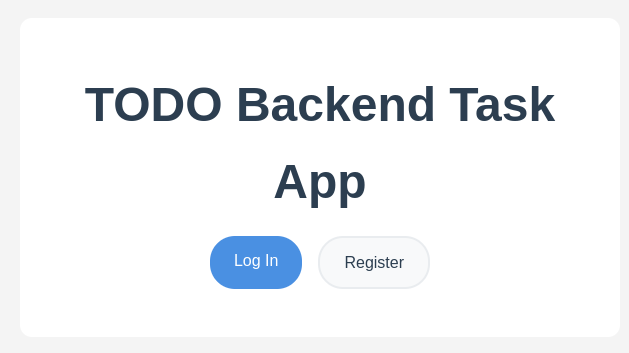
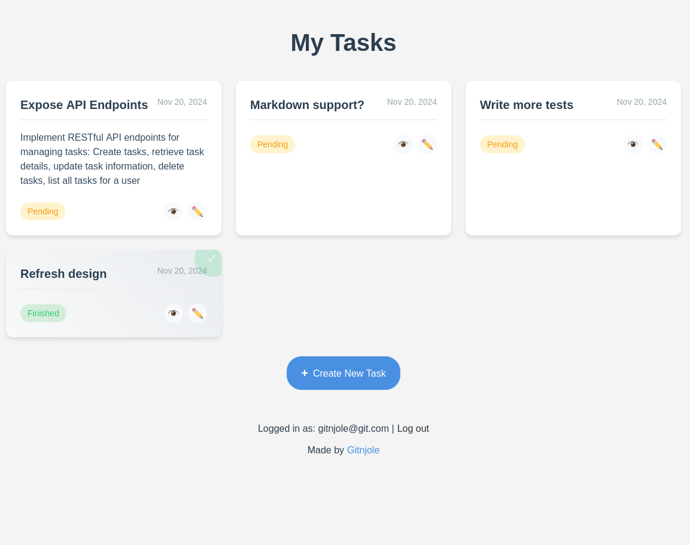

# TODO Task

## Project Overview

This is a web-based TODO application built using the Symfony PHP framework. The application provides user authentication and task management functionality, allowing users to create, track, and manage their personal TODO lists.

<div align="center">
  
</div>

## Features

- User Registration and Authentication
- Create new TODO items
- Mark TODO items as finished
- Delete TODO items
- Persistent storage of tasks in database
- Secure user-specific task management

## Prerequisites

- PHP 8.1+
- Composer
- Symfony CLI
- MySQL database

## Installation Steps

1. Clone the repository
```bash
git clone https://github.com/gitnjole/todo-be.git
cd todo-be
```

2. Install dependencies
```bash
composer install
```

3. Configure environment variables
- Copy `.env.example` to `.env`
- Update database connection settings in `.env`

4. Create database and run migrations
```bash
php bin/console doctrine:database:create
php bin/console doctrine:migrations:migrate
```

5. Start the development server
```bash
symfony server:start
```

## Project Structure

```
src/
├── Controller         # Handles HTTP requests and responses
│   ├── SecurityController.php
│   ├── TaskController.php
│   └── UserController.php
├── Entity             # Database entity definitions
│   ├── Task.php
│   └── User.php
├── Form               # Form type definitions
│   ├── RegistrationType.php
│   └── TaskType.php
├── Repository         # Database query repositories
│   ├── TaskRepository.php
│   └── UserRepository.php
├── Security           # Authentication and authorization
│   ├── AppAuthenticator.php
│   └── TaskVoter.php
└── Service            # Business logic services
    ├── TaskService.php
    └── UserService.php
```

## Authentication Flow

1. New users can register via the registration form
2. Registered users can log in with their credentials
3. After login, users are directed to their personal TODO list

## Security Features

- Password hashing
- User-specific task access control
- CSRF protection
- Authentication firewall

## Running Tests

```bash
php bin/phpunit
```

Currently, there are two tests, `TaskServiceTest` and `UserServiceTest` which both cover core business logic.

# TODO

<div align="center">
  
</div>
