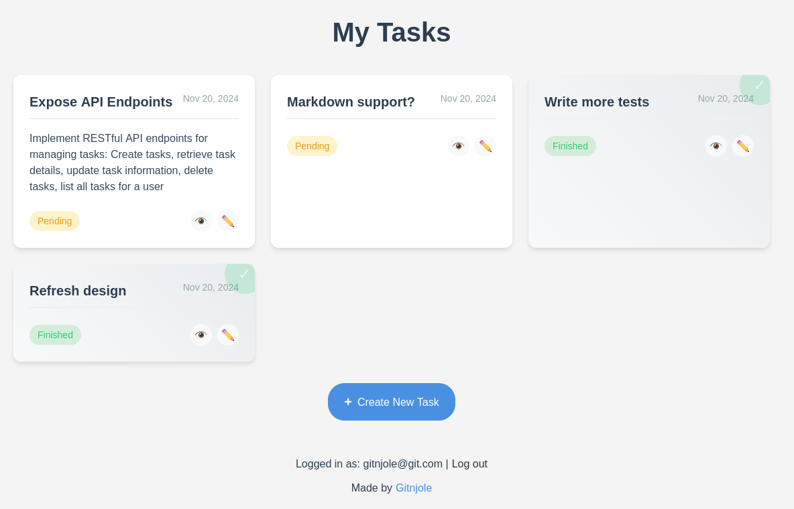

# TODO Task

## Project Overview

This is a web-based TODO application built using the Symfony PHP framework. The application provides user authentication and task management functionality, allowing users to create, track, and manage their personal TODO lists. Application can also be configured to delete tasks after a specified period of time.

<div align="center">
  
</div>

## Features

- User Registration and Authentication
- Create new tasks
- Mark tasks as finished
- Delete tasks
- Persistent storage of tasks in database
- Secure user-specific task management
- Automatic task deletion
  
## Development Status

This assignment is under active development. The main branch (`master`) contains the stable implementation of the core features as specified.

## Prerequisites

- Git
- Docker and docker-compose package

## Quick installation using Docker

1. Clone the repository
```bash
git clone https://github.com/gitnjole/todo-be.git
cd todo-be
```

2. Create and fill .env file
```bash
cp .env.example .env
```

3. Build Docker containers
```bash
docker compose build
```

4. Start Docker
```bash
docker compose up -d
```

5. Access the application at [localhost:8080](http://localhost:8080)

## Project Structure

```
src
├── Command         # Handles scheduled task deletion
│   ├── ConfigureTaskDeletionCommand.php
│   └── ScheduleTaskDeletionCommand.php
├── Controller      # Handles HTTP requests and responses                    
│   ├── SecurityController.php
│   ├── TaskController.php
│   └── UserController.php
├── Entity          # Database entity definitions
│   ├── Task.php
│   └── User.php
├── Form            # Form type definitions
│   ├── RegistrationType.php
│   └── TaskType.php
├── Repository      # Database query repositories
│   ├── TaskRepository.php
│   └── UserRepository.php
├── Security        # Authentication and authorization
│   ├── AppAuthenticator.php
│   └── TaskVoter.php
└── Service         # Business logic services
    ├── TaskAutoDeleteService.php
    ├── TaskService.php
    └── UserService.php
```

## Authentication Flow

1. New users can register via the registration form
2. Registered users can log in with their credentials
3. After login, users are directed to their personal TODO list

## Security Features

- Password hashing
- User-specific task access control
- CSRF protection
- Authentication firewall
- Environment defined login for services

## Running Tests

```bash
php bin/phpunit
```

Currently, there are two tests, `TaskServiceTest` and `UserServiceTest` which both cover core business logic.

## Running PHPStan

```bash
docker compose exec php vendor/bin/phpstan analyse src
```

Expected output:
 `[OK] No errors`                                                                                          
# TODO

<div align="center">
  
</div>

